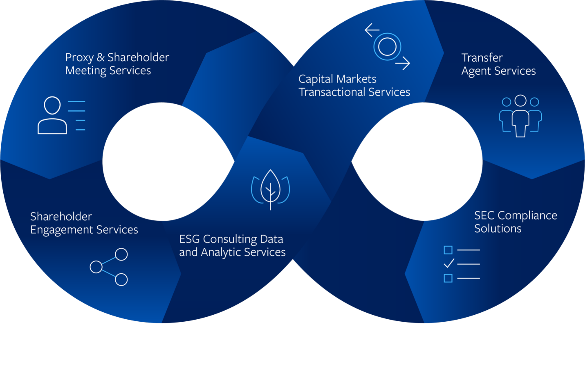

**Extracted Text:**
Broadridge®
Ready for Next

# EDGAR Filing Calendar
## 2024 SEC Filing Deadlines and Holidays

**SEC DEADLINES***

Customer Service: 713-623-5822

[EDGARfilings@broadridge.com](mailto:EDGARfilings@broadridge.com)

|                       | REPORTING PERIOD        |    |    |                   |    |    |                       |    |    | LARGE ACCELERATED                   |    |    |             |    |    |                       |    |    | ACCELERATED       |    |    |                              |                   |    |    |                 | NON-ACCELERATED       |                   |    |
|:----------------------|:------------------------|:---|:---|:------------------|:---|:---|:----------------------|:---|:---|:------------------------------------|:---|:---|:------------|:---|:---|:----------------------|:---|:---|:------------------|:---|:---|:-----------------------------|:------------------|:---|:---|:----------------|:----------------------|:------------------|:---|
|                       | FY-2023 10-K            |    |    |                   |    |    |                       |    |    | February 29, 2024                   |    |    |             |    |    |                       |    |    | March 15, 2024    |    |    |                              |                   |    |    |                 | April 1, 2024         |                   |    |
|                       | FY-2023 NT 10-K         |    |    |                   |    |    |                       |    |    | March 1, 2024                       |    |    |             |    |    |                       |    |    | March 18, 2024    |    |    |                              |                   |    |    |                 | April 2, 2024         |                   |    |
|                       | FY-2023 LATE 10-K       |    |    |                   |    |    |                       |    |    | March 15, 2024                      |    |    |             |    |    |                       |    |    | April 1, 2024     |    |    |                              |                   |    |    |                 | April 16, 2024        |                   |    |
|                       | FY-2023 PROXY or 10-K/A |    |    |                   |    |    |                       |    |    | April 29, 2024                      |    |    |             |    |    |                       |    |    | April 29, 2024    |    |    |                              |                   |    |    |                 | April 29, 2024        |                   |    |
|                       | Q1-2024 10-Q            |    |    |                   |    |    |                       |    |    | May 10, 2024                        |    |    |             |    |    |                       |    |    | May 10, 2024      |    |    |                              |                   |    |    |                 | May 15, 2024          |                   |    |
|                       | Q1-2024 NT 10-Q         |    |    |                   |    |    |                       |    |    | May 13, 2024                        |    |    |             |    |    |                       |    |    | May 13, 2024      |    |    |                              |                   |    |    |                 | May 16, 2024          |                   |    |
|                       | Q1-2024 LATE 10-Q       |    |    |                   |    |    |                       |    |    | May 15, 2024                        |    |    |             |    |    |                       |    |    | May 15, 2024      |    |    |                              |                   |    |    |                 | May 20, 2024          |                   |    |
|                       | Q2-2024 10-Q            |    |    |                   |    |    |                       |    |    | August 9, 2024                      |    |    |             |    |    |                       |    |    | August 9, 2024    |    |    |                              |                   |    |    |                 | August 14, 2024       |                   |    |
|                       | Q2-2024 NT 10-Q         |    |    |                   |    |    |                       |    |    | August 12, 2024                     |    |    |             |    |    |                       |    |    | August 12, 2024   |    |    |                              |                   |    |    |                 | August 15, 2024       |                   |    |
|                       | Q2-2024 LATE 10-Q       |    |    |                   |    |    |                       |    |    | August 14, 2024                     |    |    |             |    |    |                       |    |    | August 14, 2024   |    |    |                              |                   |    |    |                 | August 19, 2024       |                   |    |
|                       | Q3-2024 10-Q            |    |    |                   |    |    |                       |    |    | November 12, 2024                   |    |    |             |    |    |                       |    |    | November 12, 2024 |    |    |                              |                   |    |    |                 | November 14, 2024     |                   |    |
|                       | Q3-2024 NT 10-Q         |    |    |                   |    |    |                       |    |    | November 13, 2024                   |    |    |             |    |    |                       |    |    | November 13, 2024 |    |    |                              |                   |    |    |                 | November 15, 2024     |                   |    |
|                       | Q3-2024 LATE 10-Q       |    |    |                   |    |    |                       |    |    | November 18, 2024                   |    |    |             |    |    |                       |    |    | November 18, 2024 |    |    |                              |                   |    |    |                 | November 19, 2024     |                   |    |
|                       | FY-2024 10-K            |    |    |                   |    |    |                       |    |    | March 3, 2025                       |    |    |             |    |    |                       |    |    | March 17, 2025    |    |    |                              |                   |    |    |                 | March 31, 2025        |                   |    |
|                       | FY-2024 NT 10-K         |    |    |                   |    |    |                       |    |    | March 4, 2025                       |    |    |             |    |    |                       |    |    | March 18, 2025    |    |    |                              |                   |    |    |                 | April 1, 2025         |                   |    |
|                       | FY-2024 LATE 10-K       |    |    |                   |    |    |                       |    |    | March 18, 2025                      |    |    |             |    |    |                       |    |    | April 1, 2025     |    |    |                              |                   |    |    |                 | April 15, 2025        |                   |    |
|                       | FY-2024 PROXY or 10-K/A |    |    |                   |    |    |                       |    |    | April 30, 2025                      |    |    |             |    |    |                       |    |    | April 30, 2025    |    |    |                              |                   |    |    |                 | April 30, 2025        |                   |    |
| SEC DEADLINE GUIDANCE |                         |    |    |                   |    |    |                       |    |    |                                     |    |    |             |    |    |                       |    |    |                   |    |    |                              |                   |    |    |                 |                       |                   |    |
|                       |                         |    |    | LARGE ACCELERATED |    |    |                       |    |    |                                     |    |    | ACCELERATED |    |    |                       |    |    |                   |    |    |                              |                   |    |    | NON-ACCELERATED |                       |                   |    |
|                       | 10-K                    |    |    | 60                |    |    | days from year-end    |    |    |                                     |    |    | 75          |    |    | days from year-end    |    |    |                   |    |    |                              |                   |    |    | 90              | days from year-end    |                   |    |
|                       | NT 10-K                 |    |    | 15                |    |    | day extension         |    |    |                                     |    |    | 15          |    |    | day extension         |    |    |                   |    |    |                              |                   |    |    | 15              | day extension         |                   |    |
|                       | 10-Q                    |    |    | 40                |    |    | days from quarter-end |    |    |                                     |    |    | 40          |    |    | days from quarter-end |    |    |                   |    |    |                              |                   |    |    | 45              | days from quarter-end |                   |    |
|                       | NT 10-Q                 |    |    | 5                 |    |    | day extension         |    |    |                                     |    |    | 5           |    |    | day extension         |    |    |                   |    |    |                              |                   |    |    | 5               | day extension         |                   |    |
| SEC HOLIDAYS          |                         |    |    |                   |    |    |                       |    |    |                                     |    |    |             |    |    |                       |    |    |                   |    |    | FOREIGN PRIVATE ISSUERS      |                   |    |    |                 |                       |                   |    |
|                       | DATE                    |    |    |                   |    |    |                       |    |    | HOLIDAY                             |    |    |             |    |    |                       |    |    |                   |    |    |                              |                   |    |    |                 |                       |                   |    |
|                       | January 1, 2024         |    |    |                   |    |    |                       |    |    | New Year’s Day                      |    |    |             |    |    |                       |    |    |                   |    |    |                              | FY-2023 20-F      |    |    |                 |                       | April 30, 2024    |    |
|                       | January 15, 2024        |    |    |                   |    |    |                       |    |    | Birthday of Martin Luther King, Jr. |    |    |             |    |    |                       |    |    |                   |    |    |                              | FY-2023 20-F NT   |    |    |                 |                       | May 1, 2024       |    |
|                       | February 19, 2024       |    |    |                   |    |    |                       |    |    | Washington’s Birthday               |    |    |             |    |    |                       |    |    |                   |    |    |                              | FY-2023 LATE 20-F |    |    |                 |                       | May 15, 2024      |    |
|                       | May 27, 2024            |    |    |                   |    |    |                       |    |    | Memorial Day                        |    |    |             |    |    |                       |    |    |                   |    |    |                              | FY-2024 20-F      |    |    |                 |                       | April 30, 2025    |    |
|                       | June 19, 2024           |    |    |                   |    |    |                       |    |    | Juneteenth                          |    |    |             |    |    |                       |    |    |                   |    |    |                              | FY-2024 20-F NT   |    |    |                 |                       | May 1, 2025       |    |
|                       | July 4, 2024            |    |    |                   |    |    |                       |    |    | Independence Day                    |    |    |             |    |    |                       |    |    |                   |    |    |                              | FY-2024 LATE 20-F |    |    |                 |                       | May 15, 2025      |    |
|                       | September 2, 2024       |    |    |                   |    |    |                       |    |    | Labor Day                           |    |    |             |    |    |                       |    |    |                   |    |    | INVESTMENT MANAGER DEADLINES |                   |    |    |                 |                       |                   |    |
|                       | October 14, 2024        |    |    |                   |    |    |                       |    |    | Columbus Day                        |    |    |             |    |    |                       |    |    |                   |    |    |                              | 13-F              |    |    |                 |                       |                   |    |
|                       | November 11, 2024       |    |    |                   |    |    |                       |    |    | Veterans Day                        |    |    |             |    |    |                       |    |    |                   |    |    |                              | 4Q-2023 13-F      |    |    |                 |                       | February 14, 2024 |    |
|                       | November 28, 2024       |    |    |                   |    |    |                       |    |    | Thanksgiving Day                    |    |    |             |    |    |                       |    |    |                   |    |    |                              | 1Q-2024 13-F      |    |    |                 |                       | May 15, 2024      |    |
|                       | December 25, 2024       |    |    |                   |    |    |                       |    |    | Christmas Day                       |    |    |             |    |    |                       |    |    |                   |    |    |                              | 2Q-2024 13-F      |    |    |                 |                       | August 14, 2024   |    |
|                       |                         |    |    |                   |    |    |                       |    |    |                                     |    |    |             |    |    |                       |    |    |                   |    |    |                              | 3Q-2024 13-F      |    |    |                 |                       | November 14, 2024 |    |
|                       |                         |    |    |                   |    |    |                       |    |    |                                     |    |    |             |    |    |                       |    |    |                   |    |    |                              | 4Q-2024 13-F      |    |    |                 |                       | February 14, 2025 |    |

© 2023 Broadridge Financial Solutions, Inc., Broadridge and the Broadridge
logo are registered trademarks of Broadridge Financial Solutions, Inc.

**Broadridge.com**

CONFIDENTIAL INFORMATION

---

**Extracted Text:**
Broadridge®
Ready for Next

# SEC General Filing Deadlines

**LARGE ACCELERATED FILERS**

- Form 10-K due 60 days after fiscal year-end.

- NT 10-K due on the business day after the 10-K due date.

- Late 10-K due after filing an NT 10-K, the deadline for the 10-K is extended 15 calendar days from actual due date.

- Form 10-Q due 40 days after quarter-end.

- NT 10-Q due on the business day after the 10-Q due date.

- Late 10-Q due after filing an NT 10-Q, the deadline for the 10-Q is extended 5 calendar days from actual due date.

- Form 11-K due 180 days after retirement plan year-end.

- NT 11-K due on the business day after the 11-K due date.

- Late 11-K due after filing an NT 11-K, the deadline for the 11-K is extended 15 calendar days from the actual due date.

**ACCELERATED FILERS**

- Form 10-K due 75 days after fiscal year-end.

- NT 10-K due on the business day after the 10-K due date.

- Late 10-K due after filing an NT 10-K, the deadline for the 10-K is extended 15 calendar days from actual due date.

- Form 10-Q due 40 days after quarter-end.

- NT 10-Q due on the business day after the 10-Q due date.

- Late 10-Q after filing an NT 10-Q, the deadline for the 10-Q is extended 5 calendar days from actual due date.

- Form 11-K due 180 days after retirement plan year-end.

- NT 11-K due on the business day after the 11-K due date.

- Late 11-K due after filing an NT 11-K, the deadline for the 11-K is extended 15 calendar days from actual due date.

**NON-ACCELERATED FILERS**

- Form 10-K due 90 days after fiscal year-end.

- NT 10-K due on the business day after the 10-K due date.

- Late 10-K due after filing a NT 10-K, the deadline for the 10-K is extended 15 calendar days from actual due date.

- Form 10-Q due 45 days after end of quarter-end.

- NT 10-Q due on the business day after the 10-Q due date.

- Late 10-Q due after filing a NT 10-Q, the deadline for the 10-Q is extended 5 calendar days from actual due date.

- Form 11-K due 180 days after retirement plan year-end.

- NT 11-K due on the business day after the 11-K due date.

- Late 11-K due after filing a NT 11-K, the deadline for the 11-K is extended 15 calendar days from actual due date.

**FOREIGN FORMS**

- Form 20-F due within four months after the end of the fiscal year covered by the report.

- NT 20-F due on the business day after the 20-F due date.

- Late 20-F after filing a NT-20F, the deadline for the 20-F is extended 15 calendar days from actual due date.

**PROXY STATEMENTS**

- Definitive proxy statement (or information statement) is due 120 days after year-end if Part III of Form 10-K incorporates

information from proxy by reference.

**SECTION 16 BENEFICIAL OWNERSHIP FORMS**

- Form 3 due 10 days after becoming a director, officer, or beneficial owner of more than 10% of a class of equity securities

(no later than the effective date of the registration statement if the issuer is registering equity for the first time).

- Form 4 due 2 business days after the transaction date in which a company insider trades registered securities.

- Form 5 due on or before 45th day after the end of the issuer's fiscal year.

© 2023 Broadridge Financial Solutions, Inc., Broadridge and the Broadridge
logo are registered trademarks of Broadridge Financial Solutions, Inc.

**Broadridge.com**

CONFIDENTIAL INFORMATION

---

**Extracted Text:**
Broadridge®
Ready for Next

**OTHER DEADLINES**

- Form 8-K due 4 business days after the occurrence of a triggering event.

- Form SD due no later than May 31 of each year.

- Form 11-K due 90 days after the employee plans fiscal year end; if the employee plan is subject to ERISA, then 180 days

after the employee plan's fiscal year end.

- Form 40-F for Canadian foreign private issuers qualifying for the multi-jurisdictional disclosure system, then due the same

day as the issuer's annual report is due to be filed in Canada.

**INVESTMENT MANAGEMENT**

- **Form N-CEN** reports are due within 75 days of a registered investment company’s fiscal year-end. This applies to all funds,

except for unit investment trusts (UITs). A fund with multiple series with different fiscal year ends must file a separate
report for each series with the same fiscal year-end. UITs must file one Form N-CEN within 75 days of the calendar year-end.

- Form N-30D and N-CSR are due to be printed and mailed within 60 days following the end of each half-year by investment

companies. The EDGAR filing is due within 10 days after the actual mailing date.

- Form N-PX reports must be filed by August 31 each year covering the most recent 1-year period from July 1 - June 30.

- NT- NCSR submitted to notify the SEC of a late N-CSR filing and due no later than 1 business day after the actual due date.

- Schedule 13D beneficial ownership report is due within 5 business days of acquiring more than 5% of beneficial ownership

or losing eligibility to file on Schedule 13G.

- Schedule 13G beneficial ownership report for Qualified Institutional Investors (QIIs) and Exempt Investors is due 45 calendar

days after calendar quarter-end in which beneficial ownership exceeds 5%; five business days after month-end in which
beneficial ownership exceeds 10%. For Passive Investors, the due date is 5 business days after acquiring beneficial
ownership of more than 5%.

- Form 13F must be filed quarterly by institutional investment managers with at least $100 million in assets under

management within 45 days after the close of December, or by February 14 of the following calendar year.

- Form 24F-2 must be filed annually with the SEC by open-end management companies, face-amount certificate companies,

and unit investment trusts (UITs) within 90 days of the end of the fiscal year the company offered securities.

- Form N-PORT reports are required for registered investment companies and exchange-traded funds (ETFs) organized as unit

investment trusts (UITs) and must be filed no later than 60 days after the conclusion of the fiscal quarter.

- Form N-MFP must be filed monthly by money market funds to provide information about portfolio holdings (Monthly

Schedule of Portfolio Holdings) for the preceding month and due within 5 business days after the end of each month.

**FILER STATUS**

- **Large Accelerated Filer:** A reporting company that has a public float of $700 million or more, has been subject to the

periodic reporting requirements of the Securities Exchange Act of 1934 (“1934 Act”) for at least 12 months and has filed at
least one annual report.

- **Accelerated Filer:** A reporting company that has a public float of $75 million or more but less than $700 million and

revenues of $100 million or more, has been subject to the periodic reporting requirements of the 1934 Act for at least 12
months and has filed at least one annual report.

- **Non-Accelerated Filer:** A reporting company that has no public float or public float of less than $75 million or has a public

float of $75 million or more but less than $700 million and annual revenues of less than $100 million, has not been subject
to the periodic reporting requirements of the 1934 Act for more than 12 months or has not filed at least one annual report.

- **Smaller Reporting Company:** A reporting company that has (i) a public float of less than $250 million or (ii) annual revenues

of less than $100 million and has no public float or public float of less than $700 million.

- **Public float** is measured at end of second fiscal quarter, with any change in filing status taking effect as of the next fiscal

year.

For more information, contact us at 877-432-3342 or visit [www.broadridge.com](http://www.broadridge.com/)

© 2023 Broadridge Financial Solutions, Inc., Broadridge and the Broadridge
logo are registered trademarks of Broadridge Financial Solutions, Inc.

**Broadridge.com**

CONFIDENTIAL INFORMATION

---

**Extracted Text:**
Broadridge®
Ready for Next

# Other Reminders and Filing Information

EDGAR hours of operation for submitting files are 6:00 a.m. to 10:00 p.m. Eastern, weekdays, excluding SEC Federal Holidays.
Files submitted after 5:30 p.m. Eastern will receive the next business day’s filing date. Section 16 filings (Forms 3, 4, 5), SC 13D,
SC 13G, and Form 144 filed by 10:00 pm Eastern Time will receive the date of the actual filing. The EDGAR system is not in
operation on weekends. If a due date falls on a weekend or SEC holiday, the filing is due the following business day.

**SEC FILING HOURS**

**Today's Date:** 6:00 AM – 5:30 PM ET

**Tomorrow's Date:** 5:31 PM – 10:00 PM ET

**Today's Date:** 6:00 AM – 10:00 PM ET for Section 16 (Forms 3, 4, and 5), SC 13D, SC 13G, and Form 144

Companies may request a filing extension for their Form 10-Qs and 10-Ks by submitting Form 12b-25 via the EDGAR system.
By filing this form, a filer may gain up to 5 additional days to file Form 10-Q or 15 days to file Form 10-K. Companies have up to
24 hours after the original filing deadline to file Form 12b-25.

Definition of SEC Form NT 10-Q: A filing with the Securities and Exchange Commission (SEC) that a company must submit when
it is unable to file its 10-Q on time. After submission of the SEC Form NT 10-Q, the company must then file its 10-Q within 5
days. The 10-Q is a quarterly report that provides quarterly financial results. Form NT 10-Q is covered under SEC Rule 12b-25
of the Securities Exchange Act. Related filings include 10-Q, 10-QSB, and 10-QT.

Definition of SEC Form NT 10-K: A filing with the Securities and Exchange Commission (SEC) that a company must submit when
it is unable to file its 10-K on time. After submission of the SEC Form NT 10-K, the company must then file its 10-K within 15
days. The 10-K is an annual report that provides a comprehensive overview of the company's business activities. Form NT 10-K
is covered under SEC Rule 12b-25 of the Securities Exchange Act. Related filings include 10-K405, 10-K, 10-KSB405 and 10-KSB.

**SEC CONTACT INFORMATION**

|                     | Filer Support                               |    |    | 202-551-8900                                                             |    |                                                                                                        |                                                    |    |
|:--------------------|:--------------------------------------------|:---|:---|:-------------------------------------------------------------------------|:---|:-------------------------------------------------------------------------------------------------------|:---------------------------------------------------|:---|
|                     | Filing Fees Branch                          |    |    | Option # 1                                                               |    |                                                                                                        |                                                    |    |
|                     | EDGAR Technical Support                     |    |    | Option # 3                                                               |    |                                                                                                        |                                                    |    |
|                     | EDGAR Filer Support for Corporation Finance |    |    | Option # 4                                                               |    |                                                                                                        |                                                    |    |
|                     | Division of Investment Management           |    |    | Option # 5                                                               |    |                                                                                                        |                                                    |    |
|                     | Office of Structured Disclosure (OSD)       |    |    | 202-551-5494                                                             |    |                                                                                                        | StructuredData@sec.gov                             |    |
| SEC Mailing Address | SEC Mailing Address                         |    |    | SEC Headquarters                                                         |    | NOTE: Paper filings should be submitted to the SEC Headquarters address, not to the Operations Center. | NOTE: Paper filings should be submitted to the SEC |    |
|                     |                                             |    |    | 100 F Street, NE                                                         |    |                                                                                                        | Headquarters address, not to the Operations Cente  |    |
|                     |                                             |    |    | Washington, DC 20549                                                     |    |                                                                                                        |                                                    |    |
|                     | SEC Filer Support Hours of Operation        |    |    | 9:00 a.m. to 5:30 p.m. Eastern Time weekdays, excluding federal holidays |    |                                                                                                        |                                                    |    |

To apply for EDGAR access codes (CIK and CCC), visit www.filermanagement.edgarfiling.sec.gov.

**Please consult legal or general counsel to confirm what form types are needed. All information is from sources believed to be dependable; however, accuracy cannot be**
**guaranteed. Do not act or rely upon the information and advice provided within this document without seeking the services of competent professional counsel.**

© 2023 Broadridge Financial Solutions, Inc., Broadridge and the Broadridge
logo are registered trademarks of Broadridge Financial Solutions, Inc.

**Broadridge.com**

CONFIDENTIAL INFORMATION

---

**Extracted Text:**
Broadridge®
Ready for Next

# Count on Broadridge.

We help drive business transformation for our clients with solutions for enriching client engagement, navigating risk, optimizing
efficiency, and generating revenue growth.

At Broadridge we specialize in proxy and annual report stylization, design, content management, SEC filing, printing, and
distribution. We are the only provider that can provide composition, filing, print, and distribution services under one roof,
which will save you valuable time and money.

You can learn more about our complete end-to-end solution here.

**Proxy Services >** **Annual Meeting Services > Enhanced Proxy Design >**

**Extracted Text:**
Proxy & Shareholder Meeting Services
Shareholder Engagement Services
ESG Consulting Data and Analytic Services
Capital Markets Transactional Services
Transfer Agent Services
SEC Compliance Solutions

EDGAR® and SEC® are trademarks of the U.S. Securities and Exchange Commission. Broadridge’s products and services are not affiliated
with or approved by the U.S. Securities and Exchange Commission.

© 2023 Broadridge Financial Solutions, Inc., Broadridge and the Broadridge
logo are registered trademarks of Broadridge Financial Solutions, Inc.

**Broadridge.com**

CONFIDENTIAL INFORMATION

