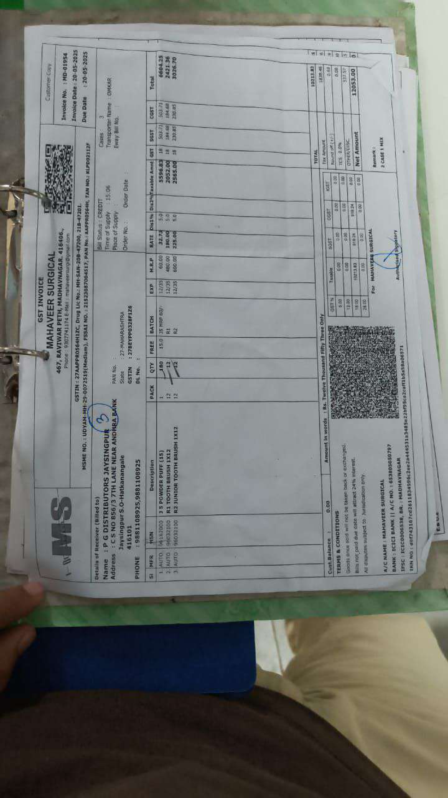
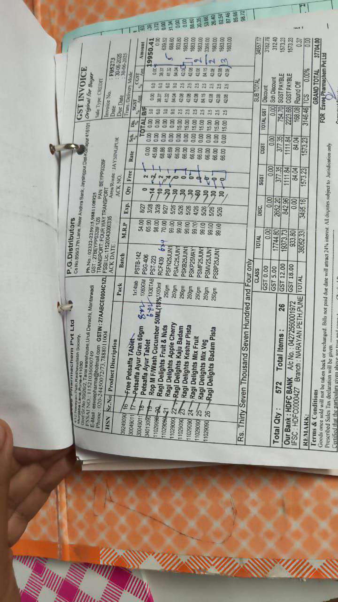
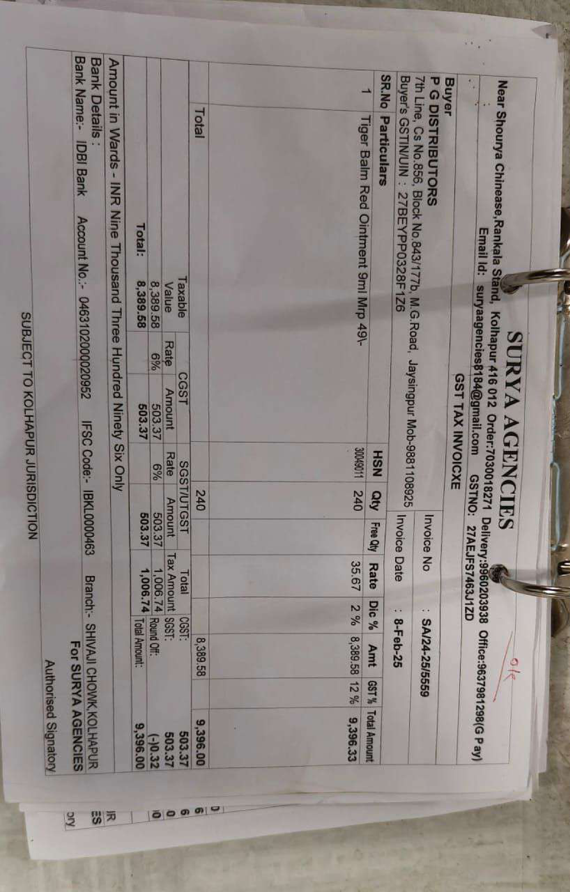
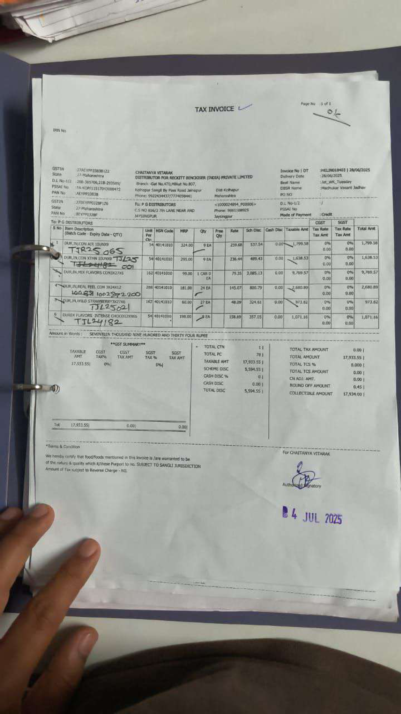

**✅ OCR Extraction (High Quality: 100.0%)**
*Document Type: Invoice Receipt*
*Language: English*
*Processing Time: 182.6s*
*Words: 209 | Characters: 1354*

---

**Mahaveer Surgical**
467, RAVIVAR PET, MADHAVNAGAR, 441646
Phone: 9530724174, 9660448174, 9825044800, 218-497201
GSTIN: MH-54N1084920M1ZM, AADHAR NO: 4449054404, PAN NO: KEP053137F

**Invoice No.:** MD-01934
**Invoice Date:** 20-05-2023
**Due Date:** 20-05-2023

**Details of Receiver (Billed to):**
Name: P.G DISTRIBUTORS JAYESINGPUR
Address: S.NO 856/3 7TH LANE NEAR ANDHRA BANK
Phone: 9530724174
GSTIN: 27MAH04837TA126
BL No.: 27MAH04837TA126

**Invoice Details:**
- **Invoice No.:** MD-01934
- **Invoice Date:** 20-05-2023
- **Due Date:** 20-05-2023

**Line Items:**
1. AUTO: 9603300
- Description: 1S POWDER PUFF (15)
- QTY: 12
- PACK: 1
- EXP: 12/23
- GST: 0.00
- RATE: 0.00%
- GST Amount: 0.00
- Total: 0.00

2. AUTO: 9603300
- Description: R2 JUNIOR TOOTH BRUSH 1X12
- QTY: 12
- PACK: 1
- EXP: 12/23
- GST: 0.00
- RATE: 0.00%
- GST Amount: 0.00
- Total: 0.00

**Total Amount:**
[Content repeats - truncated after 2 occurrences]
[Content repeats - truncated after 2 occurrences]

**Terms & Conditions:**
- Goods once sold will not be taken back or exchanged.
- Bills may get due date will attract 24% late fee.
- All disputes subject to jurisdiction only.

**Bank Details:**
- A/C NAME: MAHAVVEER SUBROTCAL
- BANK: TECICI BANK
- IFSC: TECIC000538
- PAN: MH-54N1084920M1ZM
- GSTIN: 27MAH04837TA126
- AADHAR NO: 4449054404
- PAN NO: KEP053137F

---

---

**✅ OCR Extraction (High Quality: 100.0%)**
*Document Type: Invoice Receipt*
*Language: English*
*Processing Time: 217.5s*
*Words: 414 | Characters: 2508*

SHRI RAMA STORES
PHARMA OTC DISTRIBUTORS STORES
K.B ROAD YELLAPUR
YELLAPUR-581359 STATE: KARNATAKA (29)
GSTIN: 29AAJF551KZO
PAN: AAJF551KZ
Phone: 08419-296800 Mobile: 984066461
Email: ramanaiahnair77@gmail.com

To:
P.G DISTRIBUTORS
7TH LANE CS. NO 856 BLOCK NO 843/177
B MAHATMA GANDHI ROAD JAYSGURPUR
KOLAPUR-416101 State: MAHARASHTRA (27)
GSTIN: 27BEYP0320F1Z6
Phone: 9861108925

Invoice No: 10095
Invoice Date: 10/07/2025
Terms: Credit
Page No.: 1
Transport: L.R No./ Date:
E Way Bill:
No of Cases: 4
Sales Cases: 4
Salesman: ANU/UGG/SUM

Mfr HSN Particulars Pack Batch Expiry Qty Rate Dis Mrp Spl.Dis Gst% Amount
ABB 19011090 SIMILAC MT-1 JAR 400GM 02/26 6 481.99 6.00 625.00 - 18.0 2891.94
SHR 33079010 COSMO SILKY HAIR REMOVER 40GM 02/26 36 12.23 0.00 50.00 - 18.0 440.28
SHR 33079010 COSMO SILKY HAIR REMOVER 40GM 02/26 36 12.23 0.00 50.00 - 18.0 440.28
SHR 33079010 COSMO SILKY HAIR REMOVER 40GM 02/26 24 12.23 0.00 50.00 - 18.0 293.52
EMA 30049011 MENTHOLPLUS SACH 1ML (2 1ML 05/26 3520 1.63 7.00 2.00 - 12.0 5737.60
ALK 30049011 TIGER BALM RED 09ML 09ML 03/27 60 35.00 0.00 49.00 - 12.0 2100.00
HAM 30049012 SAFI 200ML 09/26 10 89.45 12.6 120.00 - 12.0 894.50
SES 30049011 SESA OIL 100ML 100ML 11/27 12 104.78 0.00 175.00 - 12.0 1257.36
SES 30049011 SESE OIL 50ML 50ML 10/27 12 56.25 0.00 90.00 - 12.0 675.00
BR 30049014 DEN TONIC(TETHING PILLS) 15GM 10/27 120 43.28 0.00 80.00 - 18.0 5193.60
SUM 38089910 RATOL KER 25GM - 480 7.70 0.00 20.00 - 18.0 3696.00
SUM 38089910 RATOL PASTE SMALL 15GM - 120 19.29 0.00 40.00 - 18.0 2314.80
SAP 30049011 SAPAT PLUS MALAM 15GM 15GM 07/26 60 23.20 0.00 35.00 - 12.0 1392.00
CIP 24049100 NICOTEX #4 MINT 9'S 5M50137 01/27 36 101.70 8.00 150.00 - 18.0 3661.20
ZYD 33049990 GOLDEN GLOW PEEL OFF M 8GM 04/28 260 10.77 10.0 15.00 - 18.0 2800.20

No of Items: 16
4828
0.00
34228.56

GST% Trade Val Discount Assess Val IGST
0.00 17250.06 514.34 16735.72 2008.29
5.00 16978.50 746.43 16232.07 2921.77
12.00 16978.50 746.43 16232.07 2921.77
18.00 16978.50 746.43 16232.07 2921.77
28.00
Total 34228.56 1260.77 32967.79 4930.06

Rupees Thirty Seven Thousand Eight Hundred Ninety Eight Only.
Net Amount: 37898.00
CANARA BANK YELLAPUR A/C NO.03131250000310, IFSC CODE: CNRB0010313
Warranty: Goods supplied under this invoice do not contravene in any way of provision 18 of the drug act 1940
Declaration: We are registered dealers under GST Act 2017 and are liable to collect and pay taxes.
For SHRI RAMA STORES
E & O.E
Subject To YELLAPUR Jurisdiction
Authorised Signatory

---

---

**✅ OCR Extraction (High Quality: 90.0%)**
*Document Type: Invoice Receipt*
*Language: English*
*Processing Time: 230.7s*
*Words: 53 | Characters: 275*

CRITICAL RULES:
- Extract only what you can clearly see
- Do not repeat the same text multiple times
- Do not generate or imagine content
- If text is unclear, mark it as [unclear]
- Preserve formatting and structure
- Stop when you reach the end of visible content
- Write '

---

---

**✅ OCR Extraction (High Quality: 90.0%)**
*Document Type: Invoice Receipt*
*Language: English*
*Processing Time: 229.8s*
*Words: 53 | Characters: 275*

CRITICAL RULES:
- Extract only what you can clearly see
- Do not repeat the same text multiple times
- Do not generate or imagine content
- If text is unclear, mark it as [unclear]
- Preserve formatting and structure
- Stop when you reach the end of visible content
- Write '

---

---

**✅ OCR Extraction (High Quality: 90.0%)**
*Document Type: Structured Form*
*Language: English*
*Processing Time: 305.8s*
*Words: 205 | Characters: 1289*

SURYA AGENCIES
Near Shourya Chinesease, Rankala Stand, Kolhapur 416 012 Order:7030018271 Delivery:9681108925 GSTIN: 27AEJFSJ463J1ZD
Email id: suryaagencies8184@gmail.com GSTNO: 27AEJFSJ463J1ZD
Bank Name: IDBI Bank Account No.: 046310200020952 IFSC Code: IBKL0000463 Branch: SHIVAJI CHOWK KOLHAPUR
SUBJECT TO KOLHAPUR JURISDICTION
For SURYA AGENCIES
Authorised Signatory

Invoice No : SA242-25/5559
Invoice Date : 8-Feb-25

S.R.No Particulars
1 Tiger Balm Red Ointment 9ml MRP 49/-

| Taxable | CGST | Total | Amount | Rate [repetitive content removed] | Amount |
| --- | ---  [repetitive content removed]|
| Value | 240 |  |  [repetitive content removed] |
| 8,389.58 |  |  [repetitive content removed] |  |
| 6% |  |  [repetitive content removed] |  |
| 503.37 |  |  [repetitive content removed] |  |
| 6% |  |  [repetitive content removed] |  |
| 503.37 |  |  [repetitive content removed] |  |
| 1,006.74 |  |  [repetitive content removed] |  |
| 12% |  |  [repetitive content removed] |  |
| 9,396.00 |  |  [repetitive content removed] |  |
| 12% |  |  [repetitive content removed] |  |
| 9,396.00 |  |  [repetitive content removed] |  |
[Content repeats - truncated after 2 occurrences]
[Content repeats - truncated after 2 occurrences]
| 9,396.00 |  |  [repetitive content removed] |

---

---

**✅ OCR Extraction (High Quality: 100.0%)**
*Document Type: Invoice Receipt*
*Language: English*
*Processing Time: 232.4s*
*Words: 94 | Characters: 716*

NIDHI MARKETING
Gst No.4911.Meelam Panam Road Near ACPL Transport,
Alp-Haspac,Tal-Haktanang Beda-Kothapur.
DL-KO28B37124,KOL21B37125.
GSTIN/UIN: 27KGD07724MNZN
Company's PAN : ASXPDT24M

Seller
P G Distributors(GSK)
7th Lane Co.9811 Block B, 2852080283
Mumbai, Sainik Road, Andheri, Kolhapur.
Mob: 9811085823
GSTIN: 27KGD07724MNZN
Company Name: P G Distributors
Code : 27
PAN: ASXPDT24M
GSTIN: 27KGD07724MNZN
PAN: ASXPDT24M
TIN: 27KGD07724MNZN
FL No: 1102204000355
Ac No: BEYPP0328F
Bank Name: HDFC Bank Ltd. Co.4020000423932
Branch & IFSC Code: Gulbarga Branch & HFC Co4020278
IRN: 1102204000355

TAX INVOICE
Bill No: 129117
Date: 3-4-2023
Date: 3-4-2023
[Content repeats - truncated after 2 occurrences]
Date: 3-4-

---

---

**✅ OCR Extraction (High Quality: 90.0%)**
*Document Type: Mixed Content*
*Language: hindi*
*Processing Time: 161.8s*
*Words: 53 | Characters: 275*

CRITICAL RULES:
- Extract only what you can clearly see
- Do not repeat the same text multiple times
- Do not generate or imagine content
- If text is unclear, mark it as [unclear]
- Preserve formatting and structure
- Stop when you reach the end of visible content
- Write '

---

---

**❌ OCR Extraction Failed**
*Error: Poor quality extraction after retries*
*Document Type: Invoice Receipt*
*Processing Time: 161.7s*

---

---

**✅ OCR Extraction (High Quality: 100.0%)**
*Document Type: Structured Form*
*Language: English*
*Processing Time: 220.2s*
*Words: 562 | Characters: 2238*

| Item No | Item Description | Unit Price | Quantity | Gross Amount | Tax Amount | Total Amount | Net Amount | Credit Note Amount | Net Payable |
| --- | ---  [repetitive content removed]|
| 1 | 8231010 | TSG (Small) 60ml | 99.00 | 12 | 1188.00 | 101.13 | 1290.13 | 0.00 | 0.00 |
| 2 | 80781545 | Banyan Breeze 10 ml | 55.00 | 72 | 3990.00 | 359.16 | 4349.16 | 0.00 | 0.00 |
| 3 | 80845354 | Venus Breeze Balm | 18.00 | 18 | 324.00 | 27.88 | 351.88 | 0.00 | 0.00 |
| 4 | 808611467 | Whispers ON Koolarts Pants L-XL | 18.00 | 18 | 324.00 | 27.88 | 351.88 | 0.00 | 0.00 |
| 5 | 808611466 | Whispers ON Koolarts Pants L-XL | 43.50 | 4 | 174.00 | 16.13 | 190.13 | 0.00 | 0.00 |
| 6 | 80844999 | Whispers Chances XL 60 WS | 22.50 | 42 | 900.00 | 84.69 | 984.69 | 0.00 | 0.00 |
| 7 | 806100010 | Whispers ON Ultra S | 3390.00 | 1 | 3390.00 | 313.60 | 3703.60 | 0.00 | 0.00 |
| 8 | 80845166 | Whispers Choice ON XXL 65 | 320.00 | 2 | 640.00 | 59.84 | 699.84 | 0.00 | 0.00 |
| 9 | 8041000130 | Whispers RED Pants ON XXL 65 | 18.00 | 12 | 216.00 | 20.52 | 236.52 | 0.00 | 0.00 |
| 10 | 80842298 | Whispers RED Pants ON XXL 65 | 399.00 | 12 | 4788.80 | 442.50 | 5231.30 | 0.00 | 0.00 |
| 11 | 80842604 | Whispers RED Pants ON XL 65 | 399.00 | 12 | 4788.80 | 442.50 | 5231.30 | 0.00 | 0.00 |
| 12 | 806100020 | Whispers RED Pants ON MD 54 | 109.41 | 1 | 109.41 | 10.79 | 110.19 | 0.00 | 0.00 |
| 13 | 80841734 | Whispers RED Pants ON MD 54 | 106.41 | 0 | 40 | 3.50 | 43.90 | 0.00 | 0.00 |
| 14 | 80842237 | Whispers RED Pants ON LG 57 | 109.41 | 1 | 109.41 | 10.79 | 110.19 | 0.00 | 0.00 |
| 15 | 80841840 | Whispers RED Pants ON LG 57 | 106.41 | 0 | 40 | 3.50 | 43.90 | 0.00 | 0.00 |
| 16 | 80841841 | Whispers RED Pants ON LG 57 | 109.41 | 1 | 109.41 | 10.79 | 110.19 | 0.00 | 0.00 |
| 17 | 80841842 | Whispers RED Pants ON LG 57 | 106.41 | 0 | 40 | 3.50 | 43.90 | 0.00 | 0.00 |
| 18 | 80841843 | Whispers RED Pants ON LG 57 | 109.41 | 1 | 109.41 | 10.79 | 110.19 | 0.00 | 0.00 |
| 19 | 80841844 | Whispers RED Pants ON LG 57 | 106.41 | 0 | 40 | 3.50 | 43.90 | 0.00 | 0.00 |
| 20 | 80841845 | Whispers RED Pants ON LG 57 | 109.41 | 1 | 109.41 | 10.79 | 110.19 | 0.00 | 0.00 |
| Total |  |  |  | 12299.87 | 1100.72 | 13390.59 | 0.00 | 0.00 | 0.00 |

---

