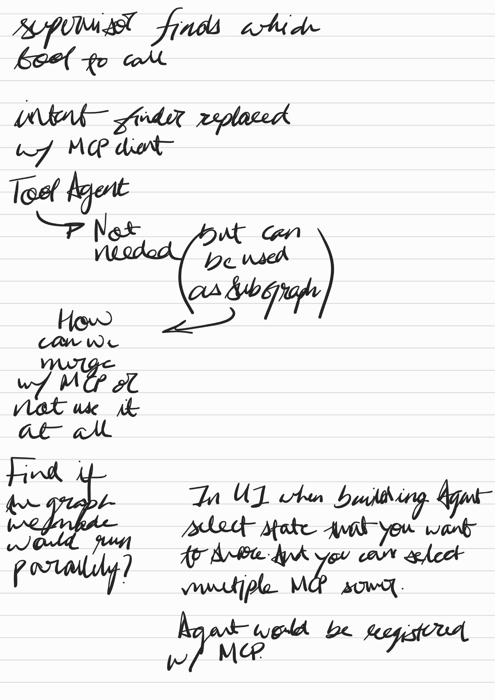
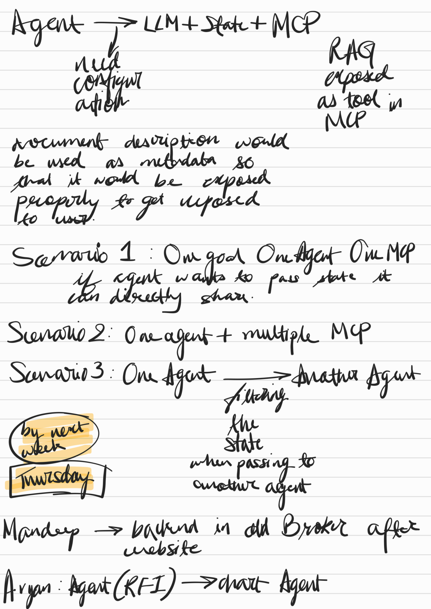
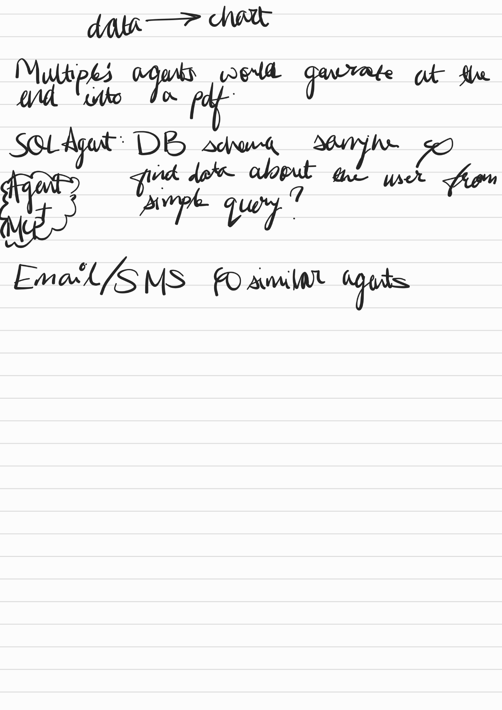

**Extracted OCR text:**
specialist finds which tool to call
intent finder replaced
my MCP client
Tool Agent
Tool Agent
P Not needed
but can be used
as subgraph
How can we use it
at all
Find if
an graph
In UI when building Agent
we make
would gun
select state that you want
would gun
to Annoe And you can select
parallelly?
multiple MCP somer
Agent would be registered
w/ MCP

---

**Extracted OCR text:**
Agent → LLM + State + MCP
RAG
exposed
as tool in MCP
Scenario 1: One goal One Agent One MCP
Scenario 2: One agent + multiple MCP
Scenario 3: One Agent → Another Agent
Thursday
by next week
the state
when passing to
Manddep → backend in old Broker after
Aryan: Agent (RFI) → draft Agent

---

**Extracted OCR text:**
data → chart
Multiples agents world generate at the end into a pdf.
SOL Agent: DB schema sample go
Agent Mut find data about the user from simple query?
Email/SMS go similar agents

