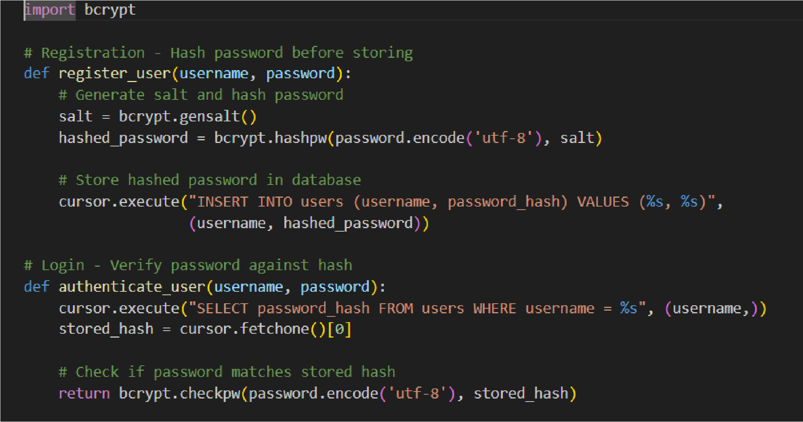
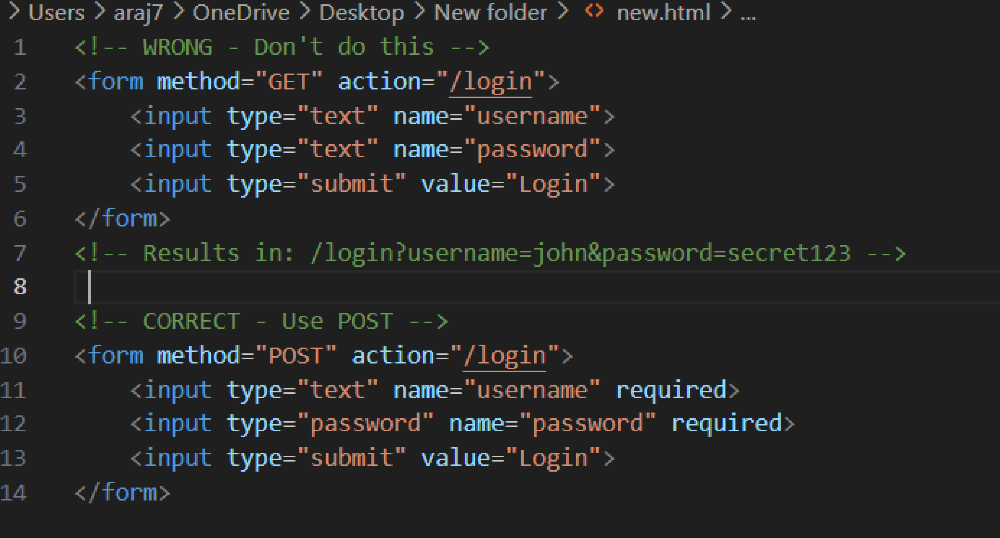
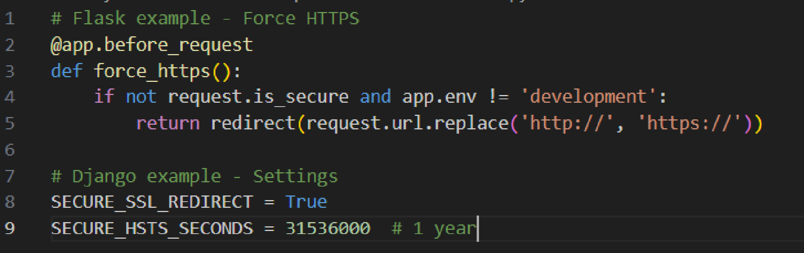
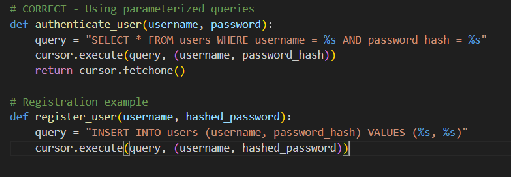
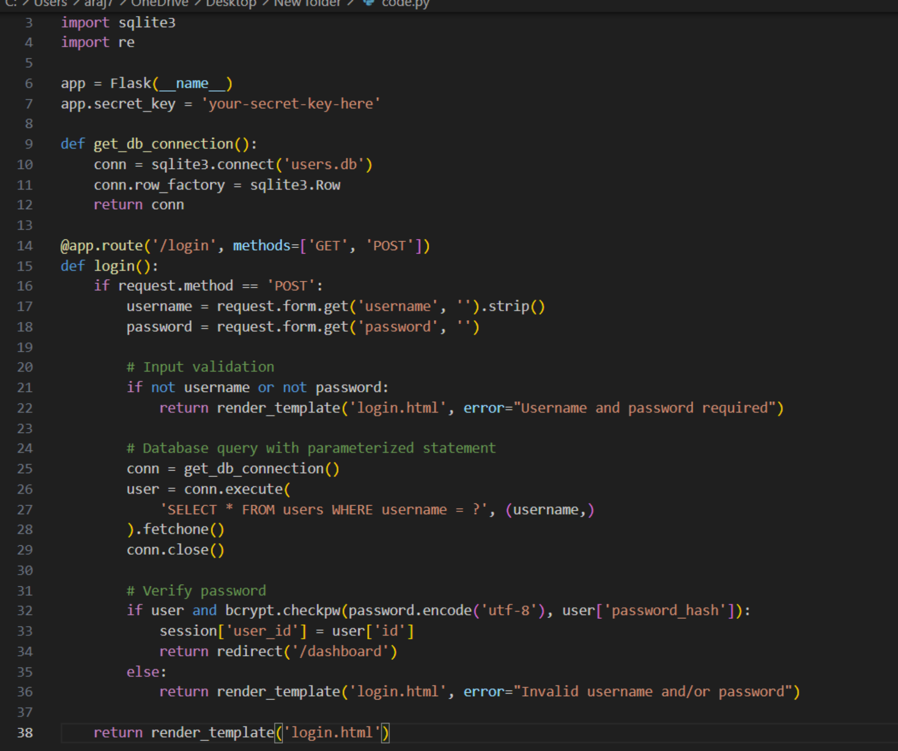

# **Secure Programming **

There are various security flaws/risks that one can face on a sign up web system.

[To address these flaws we can refer to the OWASP Secure Coding Practices](https://owasp.org/www-project-secure-coding-practices-quick-reference-guide/assets/docs/OWASP_SCP_Quick_Reference_Guide_v21.pdf)
document for suggestions to improve security of our authentication page.
## **The 5 most fundamental security improvements you should ** **implement in your web application are: ** **1. Hash Passwords with Salt (Practice[30]) **

**Problem**

Passwords are stored as plain text in the database compromising them if the
database is accessed by a wrong actor in case of a leak or such.

**Recommendation**

Implementing cryptographically strong one-way salted password hashing
(OWASP Practice [30]). Store only hashed passwords using algorithms like bcrypt,
never plain text passwords. Hash passwords on the server-side before database
storage and compare hashed values during the authentication process.

---

## **2. Use POST Instead of GET **

**Problem**

Using GET method in APIs calls to transmit authentication credentials exposes
usernames and passwords in URLs, server logs, browser history, and referrer

headers.

**Recommendation**

Use HTTP POST method exclusively for authentication data transmission
(OWASP Practice [36]). Implement form-based authentication with POST requests
to prevent credential exposure in logs and URLs.

---

## **3. Implement HTTPS/TLS ** **Problem **

Transmitting credentials as plain text over HTTP allows network eavesdropping

and man-in-the-middle attacks.

**Recommendation**

Implement TLS/HTTPS encryption for all authentication-related pages and
sensitive operations (OWASP Practices [143], [146]). Configure valid TLS
certificates and ensure all login/registration forms use encrypted connections.

---

## **4. Use Parameterized Queries **

**Problem**

Lack of parameterized queries makes the application vulnerable to SQL injection
attacks, potentially allowing database compromise.

**Recommendation**

Implement strongly typed parameterized queries for all database interactions
(OWASP Practice [167]). Use prepared statements with parameter placeholders
instead of string concatenation to separate SQL code from user data.
## **5. Server-Side Input Validation **

**Problem**

Absence of server-side input validation allows malicious data to reach the
application logic and database, enabling various attack vectors.

**Recommendation**

Implement centralized server-side input validation (OWASP Practices [1], [3]).
Validate all user inputs against expected data types, ranges, lengths, and character
sets before processing, with validation failures resulting in input rejection.

---

