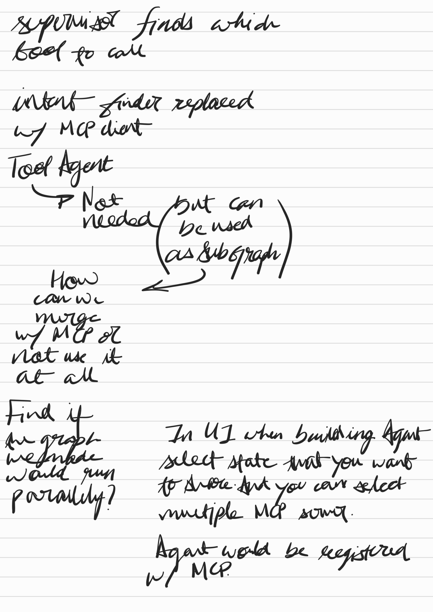
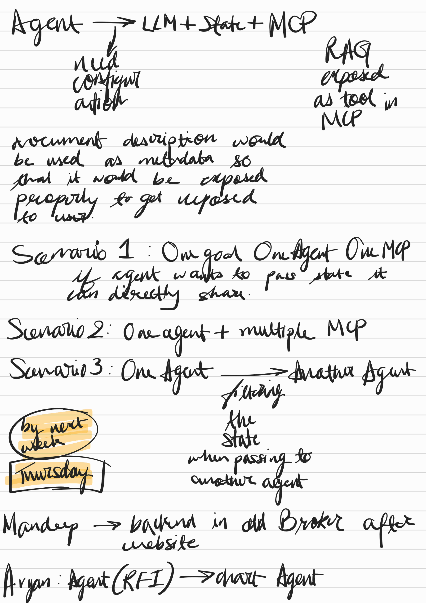

**📄 OCR Extraction (Confidence: 90.0%)**
*Document Type: Handwritten*
*Language: en*
*Processing Time: 160.2s*

specialist finds which tool to call
intent finder replaced
by MCP client
Tool Agent
How
can we
needed
but can be used
as subgraph
In UI when building Agent
we make
select state that you want
to know
and you can select
multiple MCP somer
Agent would be registered
w/ MCP

---

---

**📄 OCR Extraction (Confidence: 90.0%)**
*Document Type: Handwritten*
*Language: en*
*Processing Time: 161.0s*

Agent → LLM + State + MCP
RAG
exposed
as tool in MCP

Scenario 1: Our goal One Agent One MCP
Scenario 2: One agent + multiple MCP

Scenario 3: One Agent → → Another Agent

by next week
Thursday

when passing to
the state

Manddep → → backend in old Broker after
Aryan: Agent (RFI) → → draft Agent

---

---

**📄 OCR Extraction (Confidence: 90.0%)**
*Document Type: Handwritten*
*Language: en*
*Processing Time: 168.6s*

data → chart
Multiples agents world would generate at the end into a pdf.
SOL Agent: DB schema sample go
Agent Mut find data about the user from simple query?
Email/SMS go similar agents

---