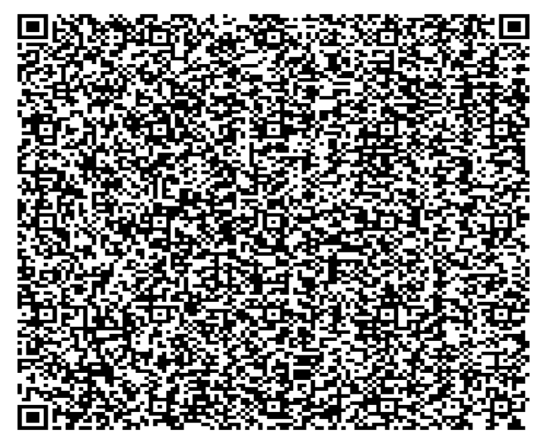

# M/s. Alsafa Traders

Plot No. 392 & 391, Market Yard, Kolhapur. 9922497592, 9284992779, 9325319789. Email: alsafa.traders1@gmail.com

|Credit Memo TAX INVOICE|Col2|Col3|Col4|Col5|Col6|Col7|Col8|Col9|Col10|Col11|Original  1|Col13|Col14|Col15|Col16|
|---|---|---|---|---|---|---|---|---|---|---|---|---|---|---|---|
|M/s.:P__.G__. _D_i_s_tr_i_b_u_t_o_rs_ Ph: 9881108925 Address: Cs No.856/3 7th Lane Near Andra Bank FSSAI No. GSTIN: 27BEYPP0328F1Z6 Place of Supply : 27-Maharashtra Town: J_a_y_s_i_n_g_p_u_r_|M/s.:P__.G__. _D_i_s_tr_i_b_u_t_o_rs_ Ph: 9881108925 Address: Cs No.856/3 7th Lane Near Andra Bank FSSAI No. GSTIN: 27BEYPP0328F1Z6 Place of Supply : 27-Maharashtra Town: J_a_y_s_i_n_g_p_u_r_|M/s.:P__.G__. _D_i_s_tr_i_b_u_t_o_rs_ Ph: 9881108925 Address: Cs No.856/3 7th Lane Near Andra Bank FSSAI No. GSTIN: 27BEYPP0328F1Z6 Place of Supply : 27-Maharashtra Town: J_a_y_s_i_n_g_p_u_r_|M/s.:P__.G__. _D_i_s_tr_i_b_u_t_o_rs_ Ph: 9881108925 Address: Cs No.856/3 7th Lane Near Andra Bank FSSAI No. GSTIN: 27BEYPP0328F1Z6 Place of Supply : 27-Maharashtra Town: J_a_y_s_i_n_g_p_u_r_|M/s.:P__.G__. _D_i_s_tr_i_b_u_t_o_rs_ Ph: 9881108925 Address: Cs No.856/3 7th Lane Near Andra Bank FSSAI No. GSTIN: 27BEYPP0328F1Z6 Place of Supply : 27-Maharashtra Town: J_a_y_s_i_n_g_p_u_r_|M/s.:P__.G__. _D_i_s_tr_i_b_u_t_o_rs_ Ph: 9881108925 Address: Cs No.856/3 7th Lane Near Andra Bank FSSAI No. GSTIN: 27BEYPP0328F1Z6 Place of Supply : 27-Maharashtra Town: J_a_y_s_i_n_g_p_u_r_|M/s.:P__.G__. _D_i_s_tr_i_b_u_t_o_rs_ Ph: 9881108925 Address: Cs No.856/3 7th Lane Near Andra Bank FSSAI No. GSTIN: 27BEYPP0328F1Z6 Place of Supply : 27-Maharashtra Town: J_a_y_s_i_n_g_p_u_r_|M/s.:P__.G__. _D_i_s_tr_i_b_u_t_o_rs_ Ph: 9881108925 Address: Cs No.856/3 7th Lane Near Andra Bank FSSAI No. GSTIN: 27BEYPP0328F1Z6 Place of Supply : 27-Maharashtra Town: J_a_y_s_i_n_g_p_u_r_|M/s.:P__.G__. _D_i_s_tr_i_b_u_t_o_rs_ Ph: 9881108925 Address: Cs No.856/3 7th Lane Near Andra Bank FSSAI No. GSTIN: 27BEYPP0328F1Z6 Place of Supply : 27-Maharashtra Town: J_a_y_s_i_n_g_p_u_r_|M/s.:P__.G__. _D_i_s_tr_i_b_u_t_o_rs_ Ph: 9881108925 Address: Cs No.856/3 7th Lane Near Andra Bank FSSAI No. GSTIN: 27BEYPP0328F1Z6 Place of Supply : 27-Maharashtra Town: J_a_y_s_i_n_g_p_u_r_|M/s.:P__.G__. _D_i_s_tr_i_b_u_t_o_rs_ Ph: 9881108925 Address: Cs No.856/3 7th Lane Near Andra Bank FSSAI No. GSTIN: 27BEYPP0328F1Z6 Place of Supply : 27-Maharashtra Town: J_a_y_s_i_n_g_p_u_r_|Invoice No.: 2221/24-25 Bill Date : 06/07/2024 Due Date : 13/07/2024 Cases Transporter|Invoice No.: 2221/24-25 Bill Date : 06/07/2024 Due Date : 13/07/2024 Cases Transporter|Invoice No.: 2221/24-25 Bill Date : 06/07/2024 Due Date : 13/07/2024 Cases Transporter|Invoice No.: 2221/24-25 Bill Date : 06/07/2024 Due Date : 13/07/2024 Cases Transporter|Invoice No.: 2221/24-25 Bill Date : 06/07/2024 Due Date : 13/07/2024 Cases Transporter|
|Sr|Product Name|HSN|MRP|Qty|Cases|Rate|Amount|Dis %|Dis Rs|Dis Rs|Dis Rs|GST %|Amount|Amount|Net Amt|
|Sr|Product Name|HSN|MRP|Qty|Cases|Rate|Amount|Dis %|Dis Rs|Dis Rs|Dis Rs|GST %|CGST|SGST|SGST|
|1 2 3 4 5 6 7 8 9 10 11 12 13 14 15 16 17 18 19 20 21 22 23 24 25|Mamypoko Pants PR NB 4 X 45pc MamyPoko Pants Standard L1 X 240pcs MamyPoko Pants Standard S4 X 48pcs (NEW) MamyPoko Pants Standard XL4 X 48pc MamyPoko Pants Standard M4 X 48pcs (MRP48) MamyPoko Pants Standard L4 X 48pcs (New) MamyPoko Pants PR NB 8 X 24pc MamyPoko Pants Standard M8 X 24pcs New MamyPoko Pants Standard S10 X 24pcs MamyPoko Pants Standard XL6 X 24pc MamyPoko Pants Standard L7 X 24pcs MamyPoko Pants Standard L14 X 12pc MamyPoko Pants Standard M16 X 12pcs MamyPoko Pants Standard S20 X 12pcs MamyPoko Pants Standard XL24 X 6pcs MamyPoko Pants Standard M32 X 6pcs MamyPoko Pants PR S50 (46+4) X 4pc Lifree Extra Absorb L2 X 32pc (MRP115) Lifree Extra Absorb M2 X 32pc (MRP 110) Lifree Extra Absorb XL2 X 32pc (MRP125) Lifree Comfort Standerd Pants L10 (4+4)X 4pc 7+1 Sofy Bodyfit XL 6P X 48pc Flatpack (MRP 35) Sofy Bodyfit Reguler 7P(6+1) X 48pc Sofy Bodyfit Antibacteria XL14 X 24pcs (MRP 140) Sofy Bodyfit Antibacteria XL 28p X 18pc (275) Total Qty|96190030 96190030 96190030 96190030 96190030 96190030 96190030 96190030 96190030 96190030 96190030 96190030 96190030 96190030 96190030 96190030 96190030 96190090 96190090 96190090 96190090 96190010 96190010 96190010 96190010|45.00 14.00 40.00 75.00 48.00 56.00 99.00 99.00 99.00 110.00 99.00 199.00 199.00 199.00 399.00 399.00 699.00 115.00 110.00 125.00 500.00 35.00 32.00 140.00 275.00|45.000 480.000 144.000 96.000 48.000 48.000 24.000 120.000 72.000 48.000 72.000 36.000 24.000 24.000 6.000 6.000 4.000 32.000 96.000 64.000 4.000 288.000 48.000 24.000 18.000 1871|1 2 3 2 1 1 1 5 3 2 3 3 2 2 1 1 1 1 3 2 1 6 1 1 1 50|31.59 9.92 28.35 53.15 34.01 39.68 69.49 70.15 70.15 77.95 70.15 141.02 141.02 141.02 282.74 282.74 490.65 80.72 77.21 87.74 350.96 27.52 25.16 110.06 216.20|1421.55 4761.60 4082.40 5102.40 1632.48 1904.64 1667.76 8418.00 5050.80 3741.60 5050.80 5076.72 3384.48 3384.48 1696.44 1696.44 1962.60 2583.04 7412.16 5615.36 1403.84 7925.76 1207.68 2641.44 3891.60|12.00 8.00 12.00 12.00 12.00 12.00 12.00 12.00 12.00 12.00 12.00 12.00 12.00 12.00 11.00 11.00 10.00 25.00 25.00 25.00 0.00 16.66 10.00 10.00 10.00|170.59 380.93 489.89 612.29 195.90 228.56 200.13 1010.2 606.10 448.99 606.10 609.21 406.14 406.14 186.61 186.61 196.26 645.76 1853.0 1403.8 0.00 1320.4 120.77 264.14 389.16|170.59 380.93 489.89 612.29 195.90 228.56 200.13 1010.2 606.10 448.99 606.10 609.21 406.14 406.14 186.61 186.61 196.26 645.76 1853.0 1403.8 0.00 1320.4 120.77 264.14 389.16|170.59 380.93 489.89 612.29 195.90 228.56 200.13 1010.2 606.10 448.99 606.10 609.21 406.14 406.14 186.61 186.61 196.26 645.76 1853.0 1403.8 0.00 1320.4 120.77 264.14 389.16|12.0 12.0 12.0 12.0 12.0 12.0 12.0 12.0 12.0 12.0 12.0 12.0 12.0 12.0 12.0 12.0 12.0 12.0 12.0 12.0 12.0|75.06 262.84 215.55 269.41 86.19 100.56 88.06 444.47 266.68 197.56 266.68 268.05 178.70 178.70 90.59 90.59 105.98 116.24 333.55 252.69 84.23|75.06 262.84 215.55 269.41 86.19 100.56 88.06 444.47 266.68 197.56 266.68 268.05 178.70 178.70 90.59 90.59 105.98 116.24 333.55 252.69 84.23|1401.08 4906.35 4023.61 5028.93 1608.96 1877.20 1643.75 8296.78 4978.06 3687.73 4978.06 5003.61 3335.74 3335.74 1691.01 1691.01 1978.30 2169.76 6226.22 4716.90 1572.30 6605.33 1086.91 2377.30 3502.44|
|Rs. : Eighty Seven Thousand Seven Hundred|Rs. : Eighty Seven Thousand Seven Hundred|Rs. : Eighty Seven Thousand Seven Hundred|Rs. : Eighty Seven Thousand Seven Hundred|Rs. : Eighty Seven Thousand Seven Hundred|Rs. : Eighty Seven Thousand Seven Hundred|Rs. : Eighty Seven Thousand Seven Hundred|Rs. : Eighty Seven Thousand Seven Hundred|Rs. : Eighty Seven Thousand Seven Hundred|Rs. : Eighty Seven Thousand Seven Hundred|Sub Total 92716.07 Add. Discount(-) Discount Amt(-) 12937.75 CESS 0.00 CGST 3972.38 SGST 3972.38 Round Off -0.08 Grand Total 87723.00|Sub Total 92716.07 Add. Discount(-) Discount Amt(-) 12937.75 CESS 0.00 CGST 3972.38 SGST 3972.38 Round Off -0.08 Grand Total 87723.00|Sub Total 92716.07 Add. Discount(-) Discount Amt(-) 12937.75 CESS 0.00 CGST 3972.38 SGST 3972.38 Round Off -0.08 Grand Total 87723.00|Sub Total 92716.07 Add. Discount(-) Discount Amt(-) 12937.75 CESS 0.00 CGST 3972.38 SGST 3972.38 Round Off -0.08 Grand Total 87723.00|Sub Total 92716.07 Add. Discount(-) Discount Amt(-) 12937.75 CESS 0.00 CGST 3972.38 SGST 3972.38 Round Off -0.08 Grand Total 87723.00|Sub Total 92716.07 Add. Discount(-) Discount Amt(-) 12937.75 CESS 0.00 CGST 3972.38 SGST 3972.38 Round Off -0.08 Grand Total 87723.00|
|Total GST : Seven Thousand Nine Hundred Forty Four And Seventy Six Paise Only|Total GST : Seven Thousand Nine Hundred Forty Four And Seventy Six Paise Only|Total GST : Seven Thousand Nine Hundred Forty Four And Seventy Six Paise Only|Total GST : Seven Thousand Nine Hundred Forty Four And Seventy Six Paise Only|Total GST : Seven Thousand Nine Hundred Forty Four And Seventy Six Paise Only|Total GST : Seven Thousand Nine Hundred Forty Four And Seventy Six Paise Only|Total GST : Seven Thousand Nine Hundred Forty Four And Seventy Six Paise Only|Total GST : Seven Thousand Nine Hundred Forty Four And Seventy Six Paise Only|Total GST : Seven Thousand Nine Hundred Forty Four And Seventy Six Paise Only|Total GST : Seven Thousand Nine Hundred Forty Four And Seventy Six Paise Only|Total GST : Seven Thousand Nine Hundred Forty Four And Seventy Six Paise Only|Total GST : Seven Thousand Nine Hundred Forty Four And Seventy Six Paise Only|Total GST : Seven Thousand Nine Hundred Forty Four And Seventy Six Paise Only|Total GST : Seven Thousand Nine Hundred Forty Four And Seventy Six Paise Only|Total GST : Seven Thousand Nine Hundred Forty Four And Seventy Six Paise Only|Total GST : Seven Thousand Nine Hundred Forty Four And Seventy Six Paise Only|
|ACK No. 122422138878091 Eway Bill No Slab Taxable Value Rate CGST Rate SGST Cess 12% 66206.34 6.0% 3972.38 6.0% 3972.38 0.00 13571.98 GSTIN: 27AAWFA5112D1ZL FSSAI No. 11517042000009 till 12/01/2023 Note :|ACK No. 122422138878091 Eway Bill No Slab Taxable Value Rate CGST Rate SGST Cess 12% 66206.34 6.0% 3972.38 6.0% 3972.38 0.00 13571.98 GSTIN: 27AAWFA5112D1ZL FSSAI No. 11517042000009 till 12/01/2023 Note :|ACK No. 122422138878091 Eway Bill No Slab Taxable Value Rate CGST Rate SGST Cess 12% 66206.34 6.0% 3972.38 6.0% 3972.38 0.00 13571.98 GSTIN: 27AAWFA5112D1ZL FSSAI No. 11517042000009 till 12/01/2023 Note :|ACK No. 122422138878091 Eway Bill No Slab Taxable Value Rate CGST Rate SGST Cess 12% 66206.34 6.0% 3972.38 6.0% 3972.38 0.00 13571.98 GSTIN: 27AAWFA5112D1ZL FSSAI No. 11517042000009 till 12/01/2023 Note :|ACK No. 122422138878091 Eway Bill No Slab Taxable Value Rate CGST Rate SGST Cess 12% 66206.34 6.0% 3972.38 6.0% 3972.38 0.00 13571.98 GSTIN: 27AAWFA5112D1ZL FSSAI No. 11517042000009 till 12/01/2023 Note :|ACK No. 122422138878091 Eway Bill No Slab Taxable Value Rate CGST Rate SGST Cess 12% 66206.34 6.0% 3972.38 6.0% 3972.38 0.00 13571.98 GSTIN: 27AAWFA5112D1ZL FSSAI No. 11517042000009 till 12/01/2023 Note :|ACK No. 122422138878091 Eway Bill No Slab Taxable Value Rate CGST Rate SGST Cess 12% 66206.34 6.0% 3972.38 6.0% 3972.38 0.00 13571.98 GSTIN: 27AAWFA5112D1ZL FSSAI No. 11517042000009 till 12/01/2023 Note :|ACK No. 122422138878091 Eway Bill No Slab Taxable Value Rate CGST Rate SGST Cess 12% 66206.34 6.0% 3972.38 6.0% 3972.38 0.00 13571.98 GSTIN: 27AAWFA5112D1ZL FSSAI No. 11517042000009 till 12/01/2023 Note :|ACK No. 122422138878091 Eway Bill No Slab Taxable Value Rate CGST Rate SGST Cess 12% 66206.34 6.0% 3972.38 6.0% 3972.38 0.00 13571.98 GSTIN: 27AAWFA5112D1ZL FSSAI No. 11517042000009 till 12/01/2023 Note :|ACK No. 122422138878091 Eway Bill No Slab Taxable Value Rate CGST Rate SGST Cess 12% 66206.34 6.0% 3972.38 6.0% 3972.38 0.00 13571.98 GSTIN: 27AAWFA5112D1ZL FSSAI No. 11517042000009 till 12/01/2023 Note :|ACK No. 122422138878091 Eway Bill No Slab Taxable Value Rate CGST Rate SGST Cess 12% 66206.34 6.0% 3972.38 6.0% 3972.38 0.00 13571.98 GSTIN: 27AAWFA5112D1ZL FSSAI No. 11517042000009 till 12/01/2023 Note :|ACK No. 122422138878091 Eway Bill No Slab Taxable Value Rate CGST Rate SGST Cess 12% 66206.34 6.0% 3972.38 6.0% 3972.38 0.00 13571.98 GSTIN: 27AAWFA5112D1ZL FSSAI No. 11517042000009 till 12/01/2023 Note :|ACK No. 122422138878091 Eway Bill No Slab Taxable Value Rate CGST Rate SGST Cess 12% 66206.34 6.0% 3972.38 6.0% 3972.38 0.00 13571.98 GSTIN: 27AAWFA5112D1ZL FSSAI No. 11517042000009 till 12/01/2023 Note :|ACK No. 122422138878091 Eway Bill No Slab Taxable Value Rate CGST Rate SGST Cess 12% 66206.34 6.0% 3972.38 6.0% 3972.38 0.00 13571.98 GSTIN: 27AAWFA5112D1ZL FSSAI No. 11517042000009 till 12/01/2023 Note :|ACK No. 122422138878091 Eway Bill No Slab Taxable Value Rate CGST Rate SGST Cess 12% 66206.34 6.0% 3972.38 6.0% 3972.38 0.00 13571.98 GSTIN: 27AAWFA5112D1ZL FSSAI No. 11517042000009 till 12/01/2023 Note :|ACK No. 122422138878091 Eway Bill No Slab Taxable Value Rate CGST Rate SGST Cess 12% 66206.34 6.0% 3972.38 6.0% 3972.38 0.00 13571.98 GSTIN: 27AAWFA5112D1ZL FSSAI No. 11517042000009 till 12/01/2023 Note :|
|ACK No. 122422138878091 Eway Bill No Slab Taxable Value Rate CGST Rate SGST Cess 12% 66206.34 6.0% 3972.38 6.0% 3972.38 0.00 13571.98 GSTIN: 27AAWFA5112D1ZL FSSAI No. 11517042000009 till 12/01/2023 Note :|ACK No. 122422138878091 Eway Bill No Slab Taxable Value Rate CGST Rate SGST Cess 12% 66206.34 6.0% 3972.38 6.0% 3972.38 0.00 13571.98 GSTIN: 27AAWFA5112D1ZL FSSAI No. 11517042000009 till 12/01/2023 Note :|ACK No. 122422138878091 Eway Bill No Slab Taxable Value Rate CGST Rate SGST Cess 12% 66206.34 6.0% 3972.38 6.0% 3972.38 0.00 13571.98 GSTIN: 27AAWFA5112D1ZL FSSAI No. 11517042000009 till 12/01/2023 Note :|ACK No. 122422138878091 Eway Bill No Slab Taxable Value Rate CGST Rate SGST Cess 12% 66206.34 6.0% 3972.38 6.0% 3972.38 0.00 13571.98 GSTIN: 27AAWFA5112D1ZL FSSAI No. 11517042000009 till 12/01/2023 Note :|ACK No. 122422138878091 Eway Bill No Slab Taxable Value Rate CGST Rate SGST Cess 12% 66206.34 6.0% 3972.38 6.0% 3972.38 0.00 13571.98 GSTIN: 27AAWFA5112D1ZL FSSAI No. 11517042000009 till 12/01/2023 Note :|ACK No. 122422138878091 Eway Bill No Slab Taxable Value Rate CGST Rate SGST Cess 12% 66206.34 6.0% 3972.38 6.0% 3972.38 0.00 13571.98 GSTIN: 27AAWFA5112D1ZL FSSAI No. 11517042000009 till 12/01/2023 Note :|ACK No. 122422138878091 Eway Bill No Slab Taxable Value Rate CGST Rate SGST Cess 12% 66206.34 6.0% 3972.38 6.0% 3972.38 0.00 13571.98 GSTIN: 27AAWFA5112D1ZL FSSAI No. 11517042000009 till 12/01/2023 Note :|ACK No. 122422138878091 Eway Bill No Slab Taxable Value Rate CGST Rate SGST Cess 12% 66206.34 6.0% 3972.38 6.0% 3972.38 0.00 13571.98 GSTIN: 27AAWFA5112D1ZL FSSAI No. 11517042000009 till 12/01/2023 Note :|ACK No. 122422138878091 Eway Bill No Slab Taxable Value Rate CGST Rate SGST Cess 12% 66206.34 6.0% 3972.38 6.0% 3972.38 0.00 13571.98 GSTIN: 27AAWFA5112D1ZL FSSAI No. 11517042000009 till 12/01/2023 Note :|ACK No. 122422138878091 Eway Bill No Slab Taxable Value Rate CGST Rate SGST Cess 12% 66206.34 6.0% 3972.38 6.0% 3972.38 0.00 13571.98 GSTIN: 27AAWFA5112D1ZL FSSAI No. 11517042000009 till 12/01/2023 Note :|For, M/s. Alsafa Traders (Authorised Signatory)|For, M/s. Alsafa Traders (Authorised Signatory)|For, M/s. Alsafa Traders (Authorised Signatory)|For, M/s. Alsafa Traders (Authorised Signatory)|For, M/s. Alsafa Traders (Authorised Signatory)|For, M/s. Alsafa Traders (Authorised Signatory)|
|KOTAK MAHINDRA BANK KOLHAPUR---A/C NO: 606044002162---RTGS NO: KKBK0001929|KOTAK MAHINDRA BANK KOLHAPUR---A/C NO: 606044002162---RTGS NO: KKBK0001929|KOTAK MAHINDRA BANK KOLHAPUR---A/C NO: 606044002162---RTGS NO: KKBK0001929|KOTAK MAHINDRA BANK KOLHAPUR---A/C NO: 606044002162---RTGS NO: KKBK0001929|KOTAK MAHINDRA BANK KOLHAPUR---A/C NO: 606044002162---RTGS NO: KKBK0001929|KOTAK MAHINDRA BANK KOLHAPUR---A/C NO: 606044002162---RTGS NO: KKBK0001929|KOTAK MAHINDRA BANK KOLHAPUR---A/C NO: 606044002162---RTGS NO: KKBK0001929|KOTAK MAHINDRA BANK KOLHAPUR---A/C NO: 606044002162---RTGS NO: KKBK0001929|KOTAK MAHINDRA BANK KOLHAPUR---A/C NO: 606044002162---RTGS NO: KKBK0001929|KOTAK MAHINDRA BANK KOLHAPUR---A/C NO: 606044002162---RTGS NO: KKBK0001929|KOTAK MAHINDRA BANK KOLHAPUR---A/C NO: 606044002162---RTGS NO: KKBK0001929|KOTAK MAHINDRA BANK KOLHAPUR---A/C NO: 606044002162---RTGS NO: KKBK0001929|KOTAK MAHINDRA BANK KOLHAPUR---A/C NO: 606044002162---RTGS NO: KKBK0001929|KOTAK MAHINDRA BANK KOLHAPUR---A/C NO: 606044002162---RTGS NO: KKBK0001929|KOTAK MAHINDRA BANK KOLHAPUR---A/C NO: 606044002162---RTGS NO: KKBK0001929|KOTAK MAHINDRA BANK KOLHAPUR---A/C NO: 606044002162---RTGS NO: KKBK0001929|
|Please Do not make any financial transactions with our any salesman(s) behalf on our name without our information or permission we are not responsible for your or your firm's any loss. Once goods sold will not be taken back. Interest will be charged @ 18% on payments made after due date. [Subject to Kolhapur Juridiction]|Please Do not make any financial transactions with our any salesman(s) behalf on our name without our information or permission we are not responsible for your or your firm's any loss. Once goods sold will not be taken back. Interest will be charged @ 18% on payments made after due date. [Subject to Kolhapur Juridiction]|Please Do not make any financial transactions with our any salesman(s) behalf on our name without our information or permission we are not responsible for your or your firm's any loss. Once goods sold will not be taken back. Interest will be charged @ 18% on payments made after due date. [Subject to Kolhapur Juridiction]|Please Do not make any financial transactions with our any salesman(s) behalf on our name without our information or permission we are not responsible for your or your firm's any loss. Once goods sold will not be taken back. Interest will be charged @ 18% on payments made after due date. [Subject to Kolhapur Juridiction]|Please Do not make any financial transactions with our any salesman(s) behalf on our name without our information or permission we are not responsible for your or your firm's any loss. Once goods sold will not be taken back. Interest will be charged @ 18% on payments made after due date. [Subject to Kolhapur Juridiction]|Please Do not make any financial transactions with our any salesman(s) behalf on our name without our information or permission we are not responsible for your or your firm's any loss. Once goods sold will not be taken back. Interest will be charged @ 18% on payments made after due date. [Subject to Kolhapur Juridiction]|Please Do not make any financial transactions with our any salesman(s) behalf on our name without our information or permission we are not responsible for your or your firm's any loss. Once goods sold will not be taken back. Interest will be charged @ 18% on payments made after due date. [Subject to Kolhapur Juridiction]|Please Do not make any financial transactions with our any salesman(s) behalf on our name without our information or permission we are not responsible for your or your firm's any loss. Once goods sold will not be taken back. Interest will be charged @ 18% on payments made after due date. [Subject to Kolhapur Juridiction]|Please Do not make any financial transactions with our any salesman(s) behalf on our name without our information or permission we are not responsible for your or your firm's any loss. Once goods sold will not be taken back. Interest will be charged @ 18% on payments made after due date. [Subject to Kolhapur Juridiction]|Please Do not make any financial transactions with our any salesman(s) behalf on our name without our information or permission we are not responsible for your or your firm's any loss. Once goods sold will not be taken back. Interest will be charged @ 18% on payments made after due date. [Subject to Kolhapur Juridiction]|Please Do not make any financial transactions with our any salesman(s) behalf on our name without our information or permission we are not responsible for your or your firm's any loss. Once goods sold will not be taken back. Interest will be charged @ 18% on payments made after due date. [Subject to Kolhapur Juridiction]|Please Do not make any financial transactions with our any salesman(s) behalf on our name without our information or permission we are not responsible for your or your firm's any loss. Once goods sold will not be taken back. Interest will be charged @ 18% on payments made after due date. [Subject to Kolhapur Juridiction]|Please Do not make any financial transactions with our any salesman(s) behalf on our name without our information or permission we are not responsible for your or your firm's any loss. Once goods sold will not be taken back. Interest will be charged @ 18% on payments made after due date. [Subject to Kolhapur Juridiction]|Please Do not make any financial transactions with our any salesman(s) behalf on our name without our information or permission we are not responsible for your or your firm's any loss. Once goods sold will not be taken back. Interest will be charged @ 18% on payments made after due date. [Subject to Kolhapur Juridiction]|Please Do not make any financial transactions with our any salesman(s) behalf on our name without our information or permission we are not responsible for your or your firm's any loss. Once goods sold will not be taken back. Interest will be charged @ 18% on payments made after due date. [Subject to Kolhapur Juridiction]|Please Do not make any financial transactions with our any salesman(s) behalf on our name without our information or permission we are not responsible for your or your firm's any loss. Once goods sold will not be taken back. Interest will be charged @ 18% on payments made after due date. [Subject to Kolhapur Juridiction]|

